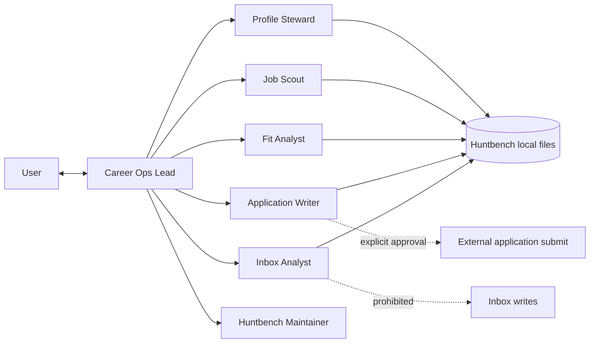

# Huntbench agent roster

These role cards split Huntbench work by responsibility. A coding-agent host can load one role directly,
or the Career Ops Lead can use them as bounded delegation prompts. Root [`AGENTS.md`](../AGENTS.md)
remains authoritative; every role inherits its safety rules.

## Roster

| Agent | Owns | Must hand off before |
|---|---|---|
| [Career Ops Lead](career-ops-lead.md) | workflow, sequencing, user approvals | specialist work when delegation is useful |
| [Profile Steward](profile-steward.md) | profile, master CV, target configuration | claiming an unverified fact |
| [Job Scout](job-scout.md) | ATS/feed/web discovery and JD enrichment | changing status or recommending an application |
| [Fit Analyst](fit-analyst.md) | evidence-based fit and risk evaluation | tailoring, outreach, or application work |
| [Application Writer](application-writer.md) | CV, cover letter, answers, apply packet | browser submission or unknown required answers |
| [Inbox Analyst](inbox-analyst.md) | read-only mail matching and change proposals | any inbox or pipeline mutation |
| [Huntbench Maintainer](huntbench-maintainer.md) | code, tests, architecture, docs | using private data in fixtures or pushing changes |

## Operating model

## Common handoff contract

Every specialist returns:

1. **Scope** — job IDs/files inspected and commands run.
2. **Evidence** — URLs, captured JD fields, candidate source facts, or test results.
3. **Changes** — files/records changed, or explicitly “none”.
4. **Unknowns** — anything requiring the user rather than an assumption.
5. **Recommended next action** — including the exact approval gate, if one applies.

Agents should use stable job IDs, preserve `jobs.ndjson` as the source of truth, avoid parallel writes
to that file, and never edit derived markdown snapshots by hand.
