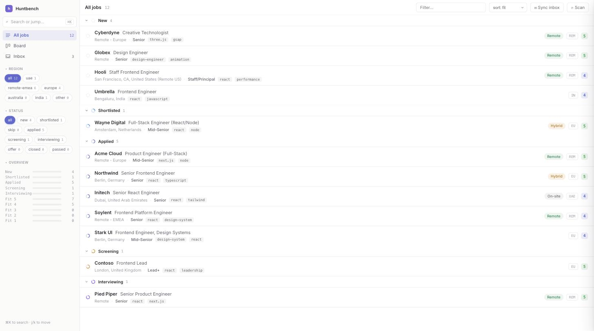

<div align="center">

# Huntbench

**Your job hunt, as mission control — driven by your own coding agent.**

### [→ Visit the site](https://rachitkhurana.github.io/huntbench/)

<a href="https://rachitkhurana.github.io/huntbench/"></a>

</div>

Huntbench is a tiny, dependency-free toolkit + local web dashboard for running a serious job
search: discover roles, score them for fit, track your pipeline on a Linear-style board, generate
tailored CVs + cover letters, prep applications, and keep every recruiter email in one place.

The clever parts — finding jobs, tailoring, filling application forms, syncing your inbox — are
done by **your** coding agent (Claude Code, Codex, Cursor, …) using **your** connected tools
(LinkedIn, Gmail, a browser). Huntbench is the deterministic engine and the beautiful local UI.
**No accounts, no servers, no API keys — your data never leaves your machine.**

---

## Quick start

```bash
git clone <this-repo> huntbench && cd huntbench
python3 jobsdb.py serve          # opens the dashboard at http://127.0.0.1:8765
```

That's it — it seeds a small **demo dataset** so the dashboard is alive immediately. Requires only
**Python 3.9+** (standard library). Chrome/Chromium (optional) is used to render CVs to PDF.

### Make it yours — with your agent

Open this folder in your coding agent and say:

> **"set me up"**

The agent reads [`AGENTS.md`](AGENTS.md), interviews you, and writes your `config/profile.yml` +
`config/master-cv.md`. Then:

```bash
python3 jobsdb.py reset --yes    # clear the demo data
python3 jobsdb.py scan           # pull fresh jobs from the ATS boards in config/portals.yml
python3 jobsdb.py serve          # triage them in the dashboard
```

Prefer to do it by hand? `python3 jobsdb.py setup` scaffolds `config/` from the examples; edit
`config/profile.yml`, `config/portals.yml`, and `config/master-cv.md`, then `serve`.

Run `python3 jobsdb.py doctor` any time to check your setup.

---

## What you get

- **Dashboard** (`serve`) — a light, Linear-style web UI: a status-grouped **list**, a drag-to-move
  **Kanban board**, and an **Inbox** (upcoming interviews + every recruiter email grouped by job),
  with a ⌘K command palette and a slide-over detail panel. There's also a keyboard-driven terminal
  UI (`dashboard`).
- **Discovery** — a zero-token **ATS scanner** (`scan`) that pulls openings straight from company
  career boards (Greenhouse/Ashby/Lever/Workable/Recruitee/SmartRecruiters), plus `add` / `bulk-add`
  for anything your agent finds elsewhere.
- **Fit scoring** — every job gets a 1–5 score from your target roles + a `portals.yml` title filter.
- **Tailored CVs** — `cv` renders a clean, ATS-safe CV + cover letter (HTML/PDF/TXT) from your
  master CV; `tailor` (or your agent) reshapes it to a specific job.
- **Apply packets** — `apply` assembles a CV + mapped form fields + drafted answers; your agent then
  fills the form in your browser and **stops before submit** for your review.
- **Interview & inbox tracking** — log interviews, and sync your Gmail so every application email
  becomes a card linking straight to its thread.

## How the AI parts work (bring your own agent)

Huntbench never calls an LLM on its own. Instead, your coding agent does the smart work in chat and
Huntbench stores/serves the results. See [`AGENTS.md`](AGENTS.md) for the full playbook. Two safety
rules the agent follows: it **never submits an application or sends an email without your review**,
and it treats your inbox as **read-only** (proposes changes, you confirm).

## Your data

Everything lives in local files you control: `jobs.ndjson` (your pipeline), `config/` (your
profile + CV), `output/` (generated CVs + packets). All of it is git-ignored — only the toolkit and
the `*.example.*` templates are tracked.

## License

MIT — see [`LICENSE`](LICENSE).
