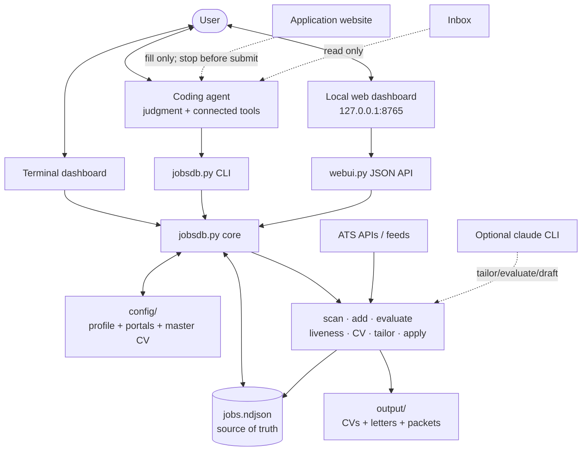
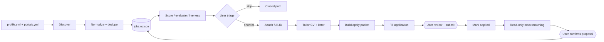
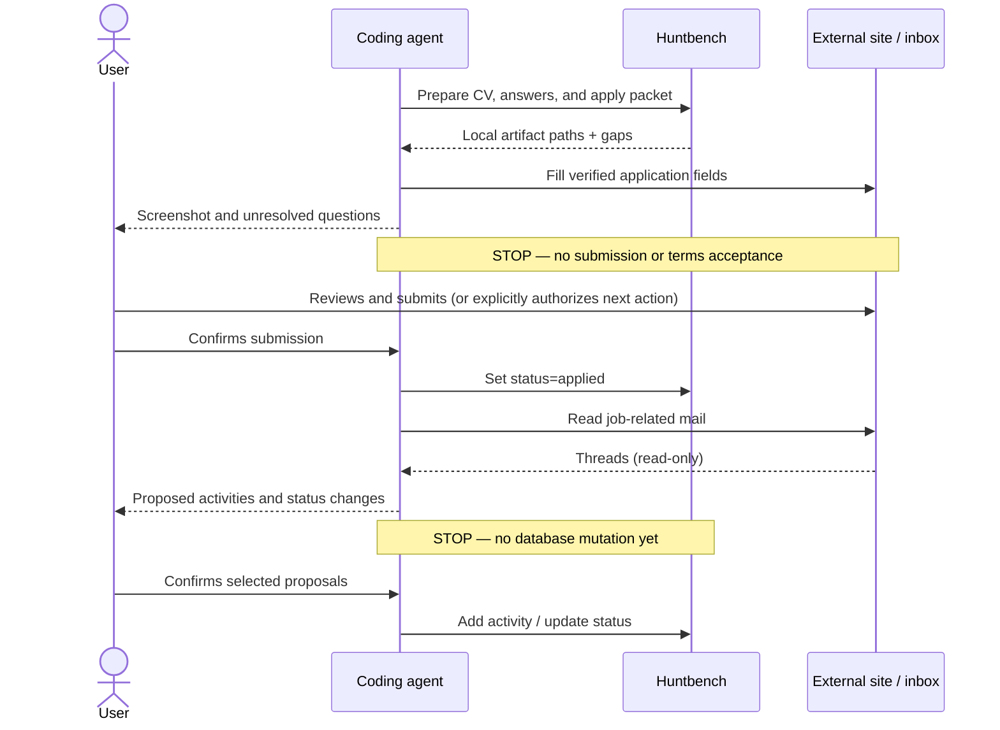
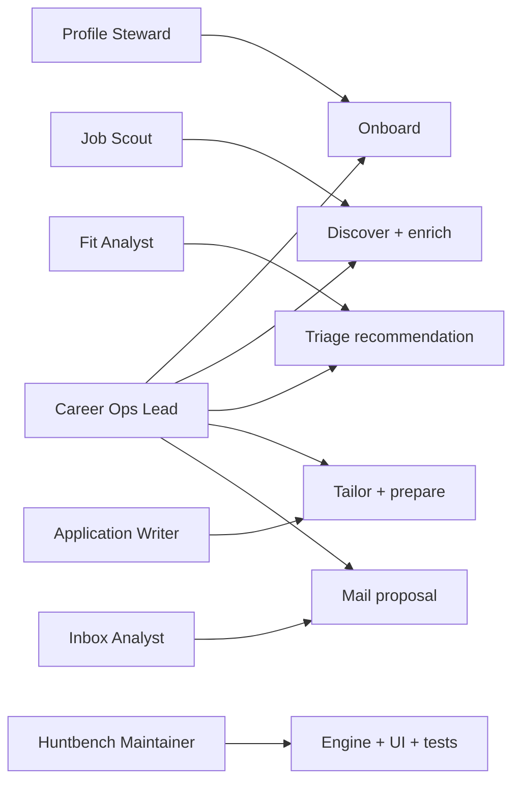

# Huntbench project guide

## What this project is

Huntbench is a local-first job-search workbench. It combines a dependency-free Python 3.9+ engine,
an NDJSON database, generated application artifacts, and two local interfaces. The software handles
repeatable mechanics; a user-controlled coding agent supplies tasks that need judgment or connected
tools. Huntbench itself does not host accounts or call an LLM service.

The key design choice is separation of powers:

- **Huntbench** stores, normalizes, scores, renders, and serves local state.
- **The coding agent** discovers, interprets, drafts, and optionally fills browser forms.
- **The user** owns factual claims and authorizes every external action.

## System map



## Repository anatomy

| Area | Purpose | Important files |
|---|---|---|
| Command/data core | CLI routing, normalization, fit/evaluation baseline, NDJSON persistence | `jobsdb.py` |
| Configuration | Dependency-free YAML loading and candidate/search settings | `configlib.py`, `config/*.example.*` |
| Discovery | ATS/feed scanning, URL/board ingestion, liveness | `scan.py`, `addjob.py`, `liveness.py` |
| Decision support | Deterministic evaluation plus optional Claude refinement | `evaluate.py` |
| Documents/application | CV/letter rendering, truthful overrides, packet assembly | `cvgen.py`, `tailor.py`, `apply.py` |
| Interfaces | Loopback HTTP API, browser UI, terminal UI | `webui.py`, `webui.html`, `static/`, `dashboard.py` |
| Agent runbooks | Safety and operating procedures | `AGENTS.md`, `APPLY-RUNBOOK.md`, `INBOX-RUNBOOK.md`, `.agents/` |
| Verification | Unit and integration-style standard-library tests | `test_jobsdb.py`, `test_scan.py`, `test_cvgen.py`, `test_addjob.py` |

## Data flow



`jobs.ndjson` contains one JSON object per line. A record normally moves through
`new → shortlisted → applied → screening → interviewing → offer`; `skip`, `closed`, and `passed`
capture exits. `saved` is independent of pipeline status. Enrichment, evaluation, and activity are
nested on the same record so the web and terminal interfaces always reload a single current source.

## Sensitive workflow gates



## Agent-to-workflow map



The complete responsibilities and handoff format are in [`.agents/README.md`](../.agents/README.md).

## Extension points

- Add an ATS/feed by implementing a provider adapter in `scan.py`, mapping it to normalized fields,
  and covering it in `test_scan.py`.
- Add a CLI capability in `jobsdb.py`; if exposed in the browser, add a narrowly scoped API route and
  UI call. Long-running web tasks must remain allowlisted.
- Extend the job schema through normalization defaults so old NDJSON records remain readable.
- Change CV layout in `cvgen.py`; verify text and PDF behavior without relying on invented data.
- Add a specialist agent only when it has a distinct evidence boundary or approval gate; document its
  handoff in `.agents/README.md`.

## Developer orientation

```bash
python3 jobsdb.py doctor
python3 test_jobsdb.py && python3 test_scan.py
python3 test_cvgen.py && python3 test_addjob.py
python3 jobsdb.py serve --no-open
```

Start with `jobsdb.py` for the data contract and command routing, then follow imports into a feature
module. For frontend work, begin at `webui.html` and `static/app.js`; API behavior lives in `webui.py`.
Use only example/demo records when testing. Runtime files such as `jobs.ndjson`, real `config/`, and
generated `output/` are local user data rather than source fixtures.
